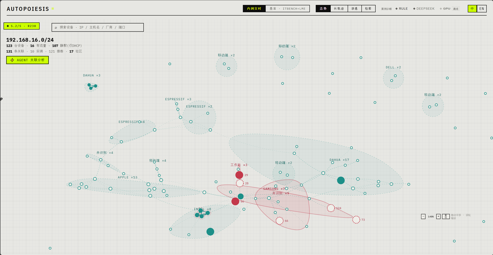
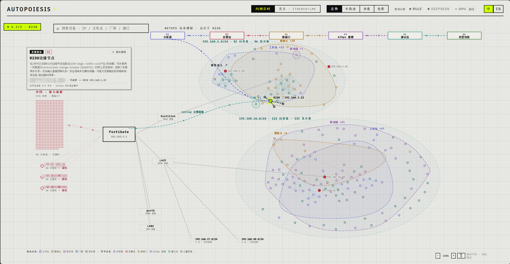

# Autopoiesis-AgentSys

**一套内网态势感知的多智能体系统，跑在一个可迁移的自演化 Agent 核心（AgentSys）之上。** 系统对真实 FortiGate/R230 内网日志做实时态势处理、根因分析、攻击面侦察与环境盲区点名；下面这层 AgentSys 把「连续运行数周的智能体会踩的坑」做成一套可测量、可回放、可演化的内核——记忆变旧或被污染、上下文无节制膨胀、技能过多干扰模型、有用经验沉淀不成稳定策略——并以清晰的域接口暴露出来，让内网态势感知只是它落地的第一个域。全部数字出自 [`core/`](./core) + [`domains/`](./domains) 的确定性 Python 内核。

<p align="left">
<b>百万级向量索引</b>&nbsp;·&nbsp;<b>8900 万+ 实时网络事件接入</b>&nbsp;·&nbsp;<b>十万条持续变更索引</b>&nbsp;·&nbsp;<b>743 项确定性测试</b>&nbsp;·&nbsp;<b>真实生产日志留出集</b>
</p>

系统分四条线，界面按这四条线展开：**在线态势线**——事件流进来，多智能体做关联、根因、侦察、检索，产出可核验的处置建议；**对话排查线**——按故障问一句话，系统先跑只读检查再让模型基于真实输出推理，产出分级 runbook；**处置闭环线**——只对已经坏掉的单台目标动手，改完回读、进观察期、指标回归就自动退回；**后台演化线**——核验通过的运行轨迹回流成记忆，经写入路由、反思、定时衰减与生产入口已接线的冲突消解沉淀为稳定策略，并投影进可增量维护的索引层。效用驱逐需要显式配置容量预算，出厂配置下不执行。

```text
在线态势:  事件流 → 关联/簇窗口 → 记忆召回(BM25/资产/关系, 可选 HNSW) → 上下文编译 → 技能调度 → 多智能体推理 → 验证 → 处置预案 + trace
对话排查:  提问 → 按故障族跑只读检查 → 真实输出入证据 → 推理(只许引用已有证据) → 分级 runbook → 分步/整体执行 → 多轮追问
处置闭环:  前置校验 → 执行 → 状态回读 → 观察期(水平触发采样) → 通过 或 验证式回滚
后台演化:  核验通过的 trace → 记忆整合/反思 → 冲突消解/定时衰减/(配置容量预算后)效用驱逐 → PostgreSQL 事务提交 → 索引事件投影 → 后台压缩
```

设计主线两句话：**在线路径保持小，后台路径负责学。**模型可以提议任何事，但能不能执行由代码判定——白名单、前置条件和分级都在模型够不到的那一层。

---

## 1 · 实时态势感知：全链路事件流处理

系统的第一现场是内网态势。真实 FortiGate/R230 syslog 经 Redpanda 跨节点事件流接入，累计接入 **8900 万+ 网络事件与 93 万+ 告警**；事件时间水位线、迟到窗口、去重与原子检查点保证乱序处理与重启恢复。态势台把整个内网按厂商聚成设备星座，下钻子网后每台设备是可点选节点，威胁点亮、`AGENT 关联分析` 拉出关系。



一条告警从原始事件走到处置预案的六段管线全部摊开——**关联器 → 告警流 → 簇窗口 → AIOps 推理 → 建议流 → 处置预案**——每段都标注真实耗时与该段用的模型（规则推理器或外部 provider）。


界面右侧是被点选告警的诊断详情：诊断时间线（首个告警→簇末告警→AIOps 推理→建议产出→假设评审→预案生成）、各阶段巡逻记录、带支持/反证计数的假设集，以及只读的处置预案草案（每一步都标「只读核查」还是「需人工审批」）。「全链路拓扑剧场」把这六段管线叠在 FortiGate → fortilink/LACP → 各子网的真实物理拓扑上，可全屏展开，把该告警走过的自愈路径在设备/记忆拓扑上高亮。



## 2 · 多智能体编排：路由、调度、升级、验证

在线路径由多个智能体分工、逐步把关，不是单模型一次答完：

- **级联意图路由**：规则快路径处理高频确定请求，语义检索召回候选技能，复合与歧义请求交给 Agent，未命中时触发技能库自扩展（回放回归测试通过后才入库）。
- **技能注意力调度**：先按相关性筛掉不相关的技能，再用学到的成功率与误用率给剩下的排序。这一环在消融里最关键——6 例真实留出集上（规则推理器）开着它 6 例全对；把它关掉（放开全部技能、不做筛选）只对 1 例；同一组消融里关掉记忆、关掉上下文压缩仍是 6 例全对。**样本只有 6 例，这是说明该环节起决定作用的消融，不是一个有统计意义的准确率数字**（详见下方说明）。
- **自适应升级**：证据有歧义、或牵涉面较大时，单 Agent 才升级为 planner-executor-critic。
- **验证**：写动作执行前检查前置条件与人工审批凭证，执行后检查后置条件、不变量与真实状态回读，失败立即停止并执行可回读补偿；诊断侧拒绝无引用、虚构引用与矛盾证据。独立的 LLM-as-judge 评审接口与主推理隔离，只做语义支持度打分。

## 3 · 自演化记忆生命周期（核心机制）

这层是 AgentSys 的核心论点：**面向连续运行数周的智能体，把记忆做成一个可测量、可回放、可演化的生命周期**，而不是一个只增不治的向量库。它是全系统的重点机制，但只是系统的一部分——上面两条态势/编排线才是它服务的对象。

- **三层记忆**（情景/语义/程序）+ 写入路由（ADD/UPDATE/NOOP）+ 可展开关联链 + 按重要度触发的反思。事件带观测时间、来源轨迹和类型化关系，`similar_to` 只参与召回。
- **在线混合召回**：分段 BM25、精确资产命中与有界两跳关系展开产生候选，`AUTOPOIESIS_ENABLE_VECTOR_MEMORY=1` 后加入 HNSW 语义候选并用结构先验重排。每条候选的词法分、向量分、资产命中、图跳数和最终分都进执行轨迹。
- **写入侧生命周期**：已核验运行后的定时衰减；哨兵事故记忆写入时的冲突消解 `supersede`；显式配置容量预算后的效用驱逐（保护先验）。

**记忆观测舱**把内核的每一次生命周期事件回放出来——三层记忆网格逐条写入、加固、抽象为洞见（185 次真实生命周期事件），右侧逐字段可审计单条记忆的置信/重要度/强度、本步写入路由与召回归因。全部读自真实内核运行 `core/evolve/observatory.py`，无合成。


**写入路由 `route()`** 决定每条记忆怎么写：按与既有记忆的相似度落在 ADD/UPDATE/NOOP 三档。真实 R230 数据集上 6 次调用全部落在 ADD 档（相似度 0.00–0.40，离 0.62 的 UPDATE 阈值还差 0.22），标尺标出「本数据集路由结果 — ADD ×6 · UPDATE ×0 · NOOP ×0」。


**上下文包**是喂给下游推理器的最终记忆，跟随回放展示每次召回如何拼装、如何变、为何进包；点开「完整上下文」可看每条记忆的排名升降、得分分解与召回后被丢弃项的 DIFF。


### 记忆检索：追平词法上限，超越已发表方案

检索核心从词袋匹配升级为分段 BM25 后，LongMemEval-500 的 recall@5 从 0.906 提到 **0.970**，追平该任务的 BM25 词法天花板，并高于 Mem0（infer=False，0.916）、Reflexion（0.918）与 Claude Code 式原子/索引记忆（0.946）。评测逐位复现各方案自报口径，全程 LLM-free。


记忆系统的真正差异化在写入侧的生命周期治理。事实更新场景下，时序互近邻 `supersede` 在旧记忆改写同实体根因时将其退役，最新答案的 recall@1 提升 **21.8 个百分点**，陈旧答案冒到首位的比例下降 **63%**。


### 混合检索实录：真实案例可回放

检索页不是抽象管线图，而是可回放的真实案例实录：顶部切换真实 RCA 案例（`eno1 无载波` / `showroom→office 不可达`，均为 phase-1 轨迹里 5× 真实运行），▶ 播放/点阶段跳步；正文里每篇命中文档带真实标题、真实正文、命中词高亮与全程轨迹徽章（命中#→融合#→上下文），末步「组装上下文」是真实喂给下游的段落加 token 预算填充。本机向量/重排离线时降级路径可见，图跳未扩展时标出「命中记忆之间无关系边可跳」。


| 能力 | 场景 | 结果 |
|---|---|---|
| 混合知识检索 | 9014 条厂商文档切片 recall@10 | BM25 主链路 + 稠密补充，0.33 → **0.42** |
| 检索路由 | 稠密路失败模式归因 | 86% 为时序歧义（对实体、错事件），据此固定按数据类型选路 |
| 上下文编译 | 2048 token 预算、八段结构化上下文 | 空分区预算回收、必需证据全保留、根因准确率不受损 |
| 技能注意力调度 | 6 例真实留出事件（消融） | 开着 **6/6**；不做技能筛选只对 **1/6** |
| 效用驱逐评测流 | 容量预算 B=10 | 优于 Ebbinghaus 衰减、LRU 与随机 |

> 关于「6/6 vs 1/6」这个消融数字：它出自 `python3 examples/benchmarks.py`，在 6 例真实 R230 留出集上用确定性规则推理器逐条复现——开着技能筛选 6 例全对，把筛选关掉（放开全部只读技能）只对 1 例，而同一组里关掉记忆、关掉上下文压缩都仍是 6 例全对。**它的意义是"哪一环起决定作用"的消融，不是准确率基准**：样本只有 6 例、推理器是确定性的，1/6 差不多是 6 个根因类里的随机水平，所以别把 6/6 当成"100% 准确率"去外推。真正有统计意义的对比是上面的 LongMemEval-500 与索引压测。

## 4 · 索引层：规模与持续变更下的召回–延迟前沿

### 向量索引：百万级规模上的召回–延迟前沿

FAISS 索引规模压测在确定性合成高斯向量上以 Flat 精确结果为真值，实测十万与百万规模的构建时间、索引体积、P95、吞吐与 Recall@10。百万条 128 维向量上，HNSW 通过 `efSearch` 扫出一条完整的召回–延迟前沿：从 `ef=32` 的 0.443@0.97ms 到 `ef=1024` 的 **0.846@21.4ms**，全程单请求 QPS 高于 Flat 精确检索（Flat P95 36.4ms、QPS 27.9）；冷构建 909.7s、索引 784MB。


### 索引生命周期：持续变更下压掉两个数量级

BM25 从查询时全量重建改为热增量倒排 + 不可变封存段 + 删除标记 + 后台压缩，查询按活跃集合的全局统计统一评分。十万条文档、20% 变更量下，查询 P95 从 929.8ms 降到 **12.0ms（77.75 倍）**，压缩回收 25% 物理条目且 Top-10 完全一致。


向量侧同理：HNSW 承担不可变基础代际，新版本进入精确增量层，删除由版本表立即过滤，后台锁外重建并原子切换。十万条向量经一万次更新与一万次删除后压缩回收两万条旧向量，P95 从 1.34ms 降到 0.98ms，重启结果一致。

## 5 · 攻击面侦察与环境盲区点名

态势感知的另一半是「事故被记录之前」的主动认知。系统在授权内网上做只读侦察与环境扫描，产出可读的攻击面而不是一堆分数。

**攻击面图**把 52 个真实资产按已挖掘关系连成图（96 条关系），地址/会话冲突、同广播域、同目的地等边分「硬证据/推断」两态；10 个暂无已挖掘关系的资产被单独点名——「不是没有关系，是这批证据里没找到」。


**地址空间占用热力图**按 /24 铺开每个地址的身份归属（已绑定身份/有流量无绑定/地址争用/无观测），把「一个地址被静态设备与服务器同时占用」这类地址争用用红格直接标出。


每条结论点开是一套**可亲自运行的验证/整改 playbook**，按真实 ip/port/服务参数化：只读验证步骤（`nc` / `nmap` / `curl` / `openssl` / `ip neigh`）可复制或就地「执行」，判定给出确有问题 vs 已缓解的分界，**整改步骤是可直接跑的具体命令**（如网关侧限制管理端口来源、数据库改 bind、TLS 只留 1.2+ 与换证），不是「加固管理网络」这种空话。


**环境感知**在事故被记录之前扫描原始网关语料，指出地址重复、作用域内无租约绑定、租约反复重建、单主机多地址、会话元组冲突、地址池压力、管理面凭据攻击。报告分两半：`findings[]` 是现有数据源能证明的，`coverage[]` 按故障类点名现有数据源无法证明的部分并写明补哪个传感器能覆盖。


这一半来自一次真实事故：192.168.1.23 被一台静态配置设备与服务器同时占用数周，唯一身份来源是网关 DHCP 服务器而占用方从未发过 DHCP 包，L2 身份源（ARP / neighbour 表）补上这一类，判定跨采集序列做归属漂移。判定同时使用实时源与全历史：每个源标注是否仍在写入，每条判定出报告前对仍在写入的源复核一次。设计见 [docs/ENVIRONMENT_PERCEPTION.md](./docs/ENVIRONMENT_PERCEPTION.md)。

## 6 · 对话式排查：先取证，再推理，谁能动手由代码决定

前五节回答「这个网络怎么了」，这一节回答「我能不能直接问它」。诊断处置页上是一个按故障问一句话的面板，但顺序和常见的聊天框相反——**先跑命令，再让模型说话**。

**开会话先取证。**提出问题时系统按故障族真的把只读检查跑一遍（`ip -br link show`、`systemctl --failed`、`ip route show default`、`cloud-init status --long` 等），把每条命令和它的**真实输出**列出来，再喂给模型。模型看到的是这台机器打印的内容，不是它自己想象的内容。没配模型时这些证据照样采集，页面如实说「未配置推理模型」，不编造诊断。

**能跑什么由白名单决定，不由模型决定。**命令用 `shlex` 解析、**不经过 shell**：管道、重定向、`;`、`&&`、反引号、`$()` 一律拒绝而不是转义。程序必须在只读名单里；有动词槽的程序（`ip` / `systemctl` / `docker` / `kubectl` / `netplan` / `cloud-init`）必须用读动词，而且写动词出现在行内任何位置都拒绝。Tailscale 路径在这一层也按名排除——**连读都不允许**，因为它是从外面进这个内网的唯一一条路。

写这层白名单时手工探测抓到一个真实漏洞：`curl -s http://... -o /etc/cron.d/x` 原本被放行，而 `curl -o` 是个**写文件原语**，能往 cron 目录、systemd 单元、`authorized_keys` 里写任意内容。现在 `-o` 只允许 `/dev/null`，`-O`/`-T`/`-d`/`-X`/`-F` 全拒，目标地址必须在私网内。这条留在这里是因为它说明白名单的要点不是列名单，而是**知道每个被放行的程序有没有隐藏的写能力**。

**风险等级由白名单重新判定。**模型把 `systemctl restart` 标成 `readonly`，系统强制改回 `gated`——标错换不来一个执行按钮。反过来模型主动标 `gated` 会被尊重：**降级归模型，升级不行**。`gated` 步骤在这条路径上根本没有执行器，`run-all` 遇到不能跑的会停在那里，不跳过去。

**引用必须真实存在。**模型引用一个会话里没有的证据编号会被直接丢弃。幻觉出来的读数没有编号可指，所以这个检查是机械的，不用去判断文字可不可信。

**多轮不丢上下文，但也不重复付费。**每一轮都能看到之前所有证据和轮次；模型可以要求补跑命令，补跑的同样过白名单。上下文按预算分级：每条读数只发头 700 + 尾 300 字符（**尾巴必须留，报错都在末尾**），追问时只有最近几条和**被引用过的**发全文，其余压成摘要，被丢弃时明说。被引用过的读数优先于仅仅是新的读数——对话正是建立在它们之上。实测十轮会话从 ¥1.09 降到 ¥0.26。

### 量化评测：评的是外壳，不是模型

评的四项都是代码的性质，所以都能对着录制的模型响应离线跑，**零成本、可进 CI**：

| 指标 | 问什么 | 离线 | 真实模型 |
|---|---|---|---|
| 证据充分性 | 开场检查有没有采到问题所依赖的那条读数 | 1.00 | 1.00 |
| 分级正确率 | 模型标错的写操作有没有被拦回去 | 1.00 | 1.00 |
| 引用真实率 | 引用的编号有几个真的存在 | 0.93 | 1.00 |
| 上下文占比 | 一轮实发字符 ÷ 全量重发 | 0.70 | 0.62 |

离线 0.93 不是缺陷，是设计好的负例：用例里故意让模型引用一个不存在的 `ev-099`，**这一项如果变成 1.00 反而说明检查失效了**。用例的期望值取自这台机器的真实状态（上行口是 eth2、默认路由经 192.168.1.1、eth0/1/3/4 无载波），期望值失配意味着要么采集退化了、要么机器变了，两种都值得失败。

真实模型评测走 `live=True`，**调用次数有硬上限**（默认 6，`AUTOPOIESIS_EVAL_MAX_CALLS` 可调）——上限在代码里强制，不交给调用方自觉，因为「再加一个变体」正是评测变成账单的方式。上表的真实模型一列是两个用例的实跑，花费约 ¥0.04。

### 成本：每一次调用都记账，重启不再重新付费

模型调用原本没有任何记录——provider 把 API 返回的 `usage` 直接丢了，唯一能看到花销的地方是服务商面板，事后、且无法归因。现在每次调用按**用途**记账，`/api/rca/cost` 给出按功能拆分的消费、token 和最贵的那次。金额按本地费率表估算并标明「以服务商账单为准」，token 数则来自 API 返回，是准的。

顺带修掉了两个把钱花在看不见的地方的设计：

**启动预热**对每个子网 × 每种语言各调一次付费模型来填一个**进程内**缓存，而部署会重启进程——于是每次 push 都重新买一遍。一个推了五次代码的晚上，十二次重启，账单几乎全在这里，而且失败被 `except: pass` 吞掉，什么都不显示。预热改为 `AUTOPOIESIS_PREWARM=1` 显式开启，它换来的只是首次点击快几秒。

**六处重复的「取配置 → 查密钥 → 建客户端 → 返回未配置」**收口到一个模块，缓存改为落盘。实测：首次 `mesh_analyze` 164 秒、一次付费调用；重启后再调 **0.026 秒、零调用**。失败结果**不入缓存**——把「未配置密钥」缓存起来，会在密钥补上之后继续返回它。

## 7 · 基准与可复现

评测为 LLM-free、确定性、可复现。基准场景把系统四条能力线映射到公开/自建基准，界面复用同一套态势 UI（换数据源不换 UI）。


- **内网根因分析 → 网络 RCA 自愈回放（真跑）**：真实 R230 FortiGate 留出集（6 类事件 × 4 pass，规则推理器）上取证 32 次，根因与引用核验逐条对上（消融见 §2 说明，6 例小样本）；6 真实用例注入 Redpanda 隔离 topic 后，端到端检测/校验/自愈逐条通过、记忆自演化 +19。
- **长期记忆/检索 → LongMemEval-500（真跑）**：分段 BM25 的 recall@5 = **0.970**，与该评测的 BM25 词法上限 0.970 一致；0.906 是升级前的词袋匹配结果。
- **自我渗透/安全 → ITBench·CISO（公开定义）**、**内网 RCA → ITBench·SRE（公开参照）**：ITBench 为公开基准（IBM，ICML 2025，arXiv:2502.05352），SRE 11.4% / CISO 25.2% / FinOps 25.8% 为公开 SOTA 基线，本地专用集群跑分标注「待跑」，未伪造本地分。


```bash
python3 examples/benchmarks.py        # §1–§3，真实 R230 集
python3 -m pytest tests_py/ -q        # 全量测试，573 passed / 8 skipped
```

## 8 · 可迁移核心：AgentSys 模块

内网态势感知是第一个落地域，但域逻辑与内核解耦——AgentSys 是可迁移的那一层，任何长周期智能体域都能复用：

- `core/memory/` — 三层记忆、BM25 检索核心、hybrid_kb 混合检索器、拓扑图记忆
- `core/evolve/` — 写入路由、A-MEM、反思、冲突消解 supersede、效用驱逐、自演化流、observatory
- `core/context/` — 结构化预算上下文压缩
- `core/orchestrator/` — 级联意图路由、自适应编排、技能调度
- `core/skills/` — 技能注册表、技能诱导、契约
- `core/verifier/` — 契约验证、引用核验

域接入只需实现自己的证据源与技能契约：`domains/network_rca`（内网 RCA，首个落地）、`domains/active_recon`（只读侦察/加固报告）、`domains/enterprise_ops`（企业运维/定价工作流，合成 fixture）都挂在同一套内核上。

## 前端与可观测

[`frontend/`](./frontend) 是 React/Vite 战术态势界面与 FastAPI 网关。`POST /api/rca/diagnose` 使用服务级长生命周期运行时，核验通过后整合记忆并触发索引维护；`/api/healthz` 暴露持久化、事件投影、索引代际、压缩线程与失败状态。后端另存逐节点追加式轨迹，覆盖召回、演变分析、技能与工具、上下文、推理、核验、记忆提交、事件持久化与后台索引维护，`run_id` 定位单次运行、`session_id` 聚合同一事故的多次运行，查询接口返回失败、部分完成、未完成节点、瓶颈与跨运行退化信号。实现见 [`docs/EXECUTION_OBSERVABILITY.md`](./docs/EXECUTION_OBSERVABILITY.md)。

`frontend/script/vreview.mjs` 用 Playwright 驱动真实浏览器做可测量前端验证（实际裁切、axe 对比度、横向滚动、console 错误、像素 diff）；本 README 的界面截图即用同一套 Playwright 驱动从真实运行中裁出。

## 事实持久化

PostgreSQL 当前状态表与只追加事件流在同一事务提交，乐观版本拒绝并发覆盖；消费端按单调偏移把事件投影到 BM25、资产索引与向量索引，全部成功后推进检查点。

## 数据

- 真实：网络设备日志、厂商技术文档、IODA v2 断网事件池、LongMemEval-500。
- 真实告警与日志含内外网 IP，走 gitignore 本地留存；仓库内带脱敏 seed 与合成 fixture，克隆后基准回退到 seed 并标注所用数据集。

## 目录

```text
core/memory/        三层记忆、BM25 检索核心、hybrid_kb 混合检索器、拓扑图记忆
core/evolve/        写入路由、A-MEM、反思、冲突消解 supersede、效用驱逐、自演化流、observatory
core/context/       结构化预算上下文压缩
core/orchestrator/  级联意图路由、自适应编排、技能调度
core/skills/        技能注册表、技能诱导、契约
core/verifier/      契约验证、引用核验
core/eval/          确定性基准、混合检索评测、独立模型证据评审与配对消融
core/llm/           OpenAI 兼容 provider、按用途记账的成本账本、单次 prompt 上限
core/investigate/   只读命令白名单（无 shell 解析）、对话排查的离线/实测评测与用例
core/remediate/     处置后观察期、水平触发采样、验证式回滚
domains/network_rca  首个落地域：内网 RCA
domains/active_recon 只读侦察 / 加固报告
domains/enterprise_ops 企业运维 / 定价工作流（合成 fixture）
frontend/           React/Vite 战术态势界面 + 记忆 observatory + FastAPI 网关
frontend/gateway/app/model_access.py   模型调用唯一入口：全局/按用途开关 + 落盘缓存
frontend/gateway/app/investigate.py    对话会话：取证在先、分级重判、引用核验、上下文预算
frontend/gateway/app/remediation.py    单调动作闭集：preflight / execute / 历史留痕
```

## 推理后端

在线路径使用 OpenAI 兼容 provider，支持外部 API 与本地 GPU 部署两种后端；确定性基准走内置规则推理器；语义支持评测使用隔离的模型评审接口。核心评测与命令行路径读取 `AUTOPOIESIS_LLM_*` 配置。

## CI / CD

`.github/workflows/` 下五条流水线：

- **CI** — `python-ci`（3.11 装 `.[dev]`、跑全量 `tests_py`、mock-labeled Phase 1.5 报告、校验真实数据集 manifest）、`frontend-ci`（Node 20、tsc 类型检查 + vite 构建为 merge gate、eslint 为 advisory、vitest）、`benchmarks`（手动/周定时的确定性基准冒烟）。
- **CD** — `release`（打 `v*` tag 时用 `frontend/Dockerfile` 构建控制台镜像并推到 GHCR）、`deploy`（push 到 main 后自动在 r450 自托管 runner 上跑 `frontend/script/deploy.sh`：ff 到 main → `npm run build` → 刷新 gateway 依赖 → `systemctl restart netops-ops-console-backend` → `/api/healthz` 健康检查；只认 push 与手动触发、不认 PR，fork 无法在自托管 runner 上执行代码）。

见 [docs/CI_SETUP.md](./docs/CI_SETUP.md)。

## roadmap

- 候选改进须通过验证器与回放门才生效，Agent 不能自由改写生产行为。
- GRPO 组相对策略优化在 [`core/evolve/`](./core/evolve) 有确定性规则版实现，在线路径使用规则推理器与 OpenAI 兼容 provider，GPU 侧梯度训练在 roadmap 中。

## 研究参考

CoALA（arXiv:2309.02427）· Mem0（2504.19413）· A-MEM（2502.12110）· Generative Agents（2304.03442）· StreamBench（2406.08747）· LongMemEval（2410.10813）· ITBench（2502.05352）· FreshDiskANN · SPFresh · Quake。记忆研究引用见 [docs/BENCHMARKS.md](./docs/BENCHMARKS.md)，动态索引研究见 [docs/INDEX_LIFECYCLE_RESEARCH.md](./docs/INDEX_LIFECYCLE_RESEARCH.md)。
