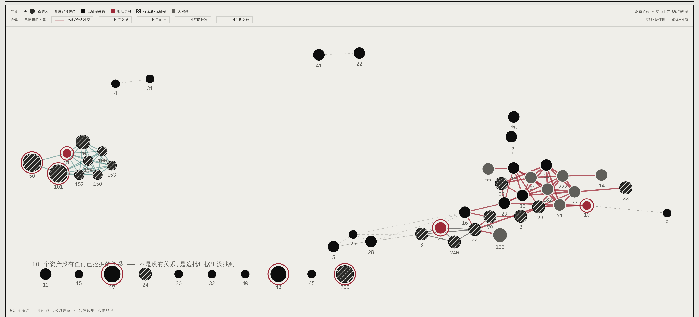
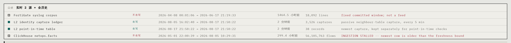
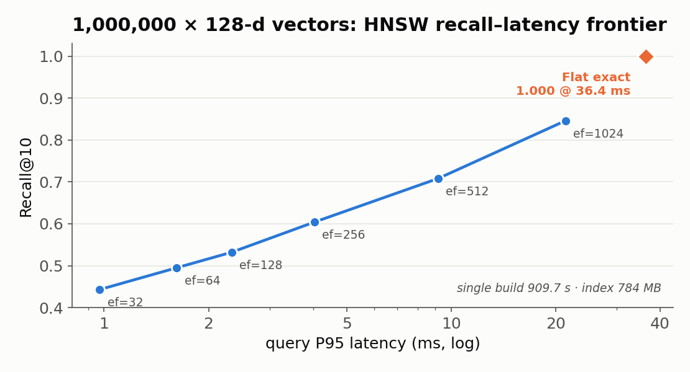
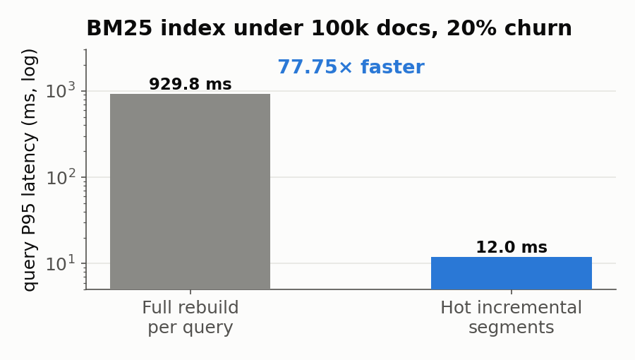

# Autopoiesis-AgentSys

面向内网的态势感知、事件调查和有界自动处置系统。系统持续读取网关安全事件、全量流量事实、处置时间线与二层身份发现，把一次事件整理成可核验的故障档案，把跨时间风险聚合成长期记录，再从多个已验证案例中提炼可复用的网络特征。

记忆系统在这里承担三个具体职责：

1. 为当前调查安排更有依据的探针顺序。
2. 提示某个动作在相似场景中的有效性、失败记录和复发风险。
3. 保存“哪条记忆影响了哪次调查”的归因记录，支持回放和消融评测。

动作能否执行由当前证据、动作策略、安全门、预算、锁和回读结果共同决定。记忆提供调查先验，不提供写操作授权。

## 当前业务闭环

一个案件只允许产生五种对运维有直接用途的结果：继续调查、动作就绪、观察中、已解决、已升级。统一的 `BusinessDecision` 保存案件标识、结论、受影响资产、决定性证据、处置决定、实际动作、缺失观察和动作回读。页面读取这个对象，模型阶段名称、检索分数、未核实假设、草稿预案和置信度条均不进入主界面。

| 业务场景 | 决策方法 | 结案条件 | 页面结果 |
|---|---|---|---|
| 公网来源访问防火墙本机并被拒绝 | 使用原始日志的 `subtype=local`、`policytype=local-in-policy`、WAN 入站和 `action=deny` 直接判定 | 四项事实同时成立 | 外部探测已拦截，保持拒绝策略，无需创建放行规则 |
| 转发流量或策略语义不完整 | 精确查询同一事件窗口和五元组，再读取当前设备策略 | 流量事实、当前策略和业务放行意图一致 | 形成关闭或处置决定；缺任一项时显示具体缺失观察和下一项探针 |
| 主机服务、链路和资源故障 | 多个候选原因使用当前只读观察相互区分；预定义条件全部排除后进入开放根因调查 | 唯一根因由当前观察确认，其余候选已排除 | 生成一个可执行动作，或明确升级责任范围；开放根因未确认时保持调查中 |
| 白名单动作执行 | 记录幂等执行标识，随后从目标系统读取结果 | 快速观察、稳定观察和最终回读通过 | resolved；回读失败或保护指标恶化时 escalated / reverted |
| 相似案件复发 | 已验证记忆只能调整探针次序和提示动作适用条件 | 同一输入下根因保持一致，首次确认步骤减少，错误动作不增加 | 保存配对结果；没有产生增量时不计业务收益 |

所有行共享同一条状态链：`真实记录 → case_id → 当前观察 → BusinessDecision → 白名单动作 → 原系统回读 → 已验证案件记忆`。其中 `case_id` 从告警进入调查、动作历史和回读记录，保证列表里的案件、详情里的证据和最终动作属于同一次事件。

### 六项业务价值及其可执行验收

系统按案件记录计算六项结果。`GET /api/rca/investigate/business-value` 读取实际案件时间线和调查会话，逐项返回 `proven`、`partial`、`failed` 或 `not_observed`，并列出通过的案件标识、分子、分母和测量值。`failed` 表示已有适用案件但全部未通过，`not_observed` 表示尚无适用案件。默认 `cohort=production` 只计算当前数据流产生的生产案件；`?cohort=latest_acceptance` 读取最近一次受控验收；`?cohort=all` 合并生产案件与最近一次受控验收。三个口径分别展示，代码存在、单元测试通过和页面可见均不直接计为业务价值。

实时接案目前有三条入口。事件处理服务从实时安全日志中形成告警，局域网广播和组播拒绝在检测阶段退出案件链；网关认证攻击按一分钟内失败次数与不同公网来源数形成一个持续事件；二层身份巡检只把已经通过当前 DHCP、ARP 和历史所有权交叉核验的高风险发现写入案件。每个入口都产生稳定来源标识、受管资产、时间范围和故障域，后台据此启动调查。地址冲突调查重新读取当前二层身份报告，网关认证调查精确查询同一设备和时间窗口内的安全事件，调查结论保存实际探针证据。

| 价值点 | 必须出现的实际记录 | 通过条件 |
|---|---|---|
| 自动接管事故 | `investigation_session_started` | 后台自动启动，记录受管资产、有界时间范围、故障域和范围质量；无法圈定资产时停止探针并保留缺失字段 |
| 解决开放故障 | 模型来源根因、冻结探针、支持或反证 | 两个不同诊断信号均在执行前冻结判据，当前输出全部支持，根因进入最终案件决定 |
| 减少错误结论 | 根因支持边与 `BusinessDecision.evidence` | 最终证据标识属于该根因的机械支持集合；无支持根因时不发布引用和结论 |
| 缩短处理时间 | 同一当前案件的无记忆和完整系统配对 | 两次探针输出指纹一致、确认根因一致、候选覆盖一致，完整系统用更少步骤首次确认 |
| 完成处置和恢复确认 | `action_ready → remediation_started → remediation_completed` | 精确目标通过白名单和前置检查，动作执行后取得原系统回读；通过则关闭，失败或异常则升级并停止后续变更 |
| 让记忆在复发事故中产生收益 | `memory_value_measured` | 首次事故与复发事故根因一致且复发所需探针更少，同时同一复发案件的无记忆配对也通过 |

聚合器位于 [`core/eval/business_value_acceptance.py`](./core/eval/business_value_acceptance.py)。复发案件按故障族、故障域、服务和受管资产形成 cohort，系统只在出现独立历史案件时触发配对。公网探测已被拒绝这类终态安全事件不具备记忆提速空间，会退出记忆收益评测。

2026-08-31 的最新受控主机验收为 [`benchmark_results/business_value_acceptance_20260831_post_live.json`](./benchmark_results/business_value_acceptance_20260831_post_live.json)，运行标识 `20260831T205624Z-8fa298`。验收创建仅绑定回环地址的临时 systemd 服务，实际触发首次启动失败、复发退出、永久启动失败和结构版本不一致，最后清理临时单元。开放调查由本机 Codex 提出候选，产品执行端完成探针确认，全程未调用 DeepSeek。六项结果如下：

| 价值点 | 受控结果 | 直接证据 |
|---|---:|---|
| 自动接案 | 6/6 | 六个案件均由后台启动，并保存资产、时间范围和故障域 |
| 开放根因调查 | 1/1 | 固定目录排除后，Codex 分析端提出新根因，产品执行端冻结并运行端点与服务状态两类探针，`ev-008`、`ev-009` 同时支持 |
| 结论约束 | 6/6 | 最终决定只引用对应根因的当前支持证据，模型根因满足双信号条件 |
| 真实提速 | 1/1 | 每个策略执行三次并取中位数；固定脚本 6 个探针、首次确认第 3 步、1176.366ms，完整系统 1 个探针、首次确认第 1 步、747.735ms |
| 动作与恢复 | 5/5 | 成功重启取得稳定回读；永久失败返回 `revert_unverified`，案件升级并停止继续变更 |
| 复发记忆收益 | 1/1 | 同一根因从首次事故 6 个探针缩短到复发事故 1 个探针，首次确认从第 3 步提前到第 1 步；同案固定脚本、关闭记忆和完整系统三臂根因一致 |

当前生产口径独立计算。现场数据已形成 4 个自动接管案件，包括 3 个二层地址归属冲突和 1 个 SSL VPN 分布式认证攻击；自动接管为 4/4，当前证据支持的最终结论为 4/4。生产流中尚未自然出现可安全执行的服务故障、固定目录外的新根因和完成首次调查后的独立复发，因此开放根因、调查提速、动作回读和复发记忆四项保持 `not_observed`。这些状态由默认 `cohort=production` 接口直接返回。

验收脚本位于 [`scripts/run_business_value_acceptance.py`](./scripts/run_business_value_acceptance.py)，故障目标位于 [`scripts/business_value_fault_target.py`](./scripts/business_value_fault_target.py)。脚本使用独立动作预算、暂停开关、记忆存储和配对账本；开放调查调用本机 Codex，根因确认仍由产品执行的当前探针完成。

### 案件级业务验收契约

每条真实案件必须通过以下检查：

1. 来源字段完整保留，包括 IP、端口、协议、接口角色、流量类型、策略类型、策略 ID、设备动作和时间窗口；`policyid=0` 也必须原样保留。
2. 检测记录在相同来源标识下归并成唯一 `case_id`，回放和演练数据默认退出实时案件列表。
3. 已解决案件必须给出处置决定和决定性证据。调查中案件必须给出能够阻止结案的缺失观察及下一项可执行只读探针。
4. 自动动作必须来自白名单，并保存执行标识、动作回执和目标系统回读。动作建议、命令草稿和模型文本不计完成。
5. 开放根因的确认探针必须来自有明确诊断含义的只读工具，并覆盖至少两个不同信号域；`date`、`uptime` 等通用读数不能确认新根因。
6. 记忆收益同时检查首次事故到复发事故的实际探针变化，以及复发案件自身的无记忆配对；任一对照失败都不计收益。

内部测试集按这六条组织：来源字段、范围圈定和案件归并位于数据读取、案件范围和案件持久化测试；开放根因、无关引用和双信号确认位于调查会话测试；案件决策、自动动作、失败停止、回读和配对收益位于业务闭环测试；业务价值聚合口径由 `tests_py/test_business_value_acceptance.py` 锁定；跨时间反证、重启恢复和记忆消融位于 `tests_py/test_temporal_case_evaluation.py`。固定案例锁定机制契约，部署准入读取当前数据流形成的案件，计算根因正确率、错误结案率、错误动作率、首次确认探针数和动作回读成功率。

## 先看三个真实 use case

仓库提供两套演示。第一套包含安全事件与服务故障两个场景，第二套展示记忆和知识检索如何参与一次新调查。调查得出唯一根因且动作前置检查通过后，诊断页面显示一条“根因、动作、目标、结果回读”决策线。写操作仍受白名单、预算、锁和观察窗口约束。

准备：

~~~bash
ssh <user>@<R450 的 Tailscale IP>
cd /data/Autopoiesis-AgentSys
sudo ./scripts/demo_memory_rag.sh cleanup
sudo ./scripts/inject_incident.sh status
curl -fsS http://127.0.0.1:8026/api/healthz | python3 -m json.tool
~~~

浏览器打开：

~~~text
http://<R450 的 Tailscale IP>:2026
~~~

完整逐镜头操作说明见 [scripts/DEMO.md](./scripts/DEMO.md)。

### Use case A：安全事件被发现，安全门保留防火墙配置

~~~bash
sudo ./scripts/inject_incident.sh bruteforce
~~~

脚本向本机认证日志写入 12 条来自 RFC 5737 演示地址 203.0.113.77 的失败登录记录。哨兵完成检测与二次确认后，把临时封禁列为候选动作，并逐项检查来源归属、活动管理会话、管理地址豁免、封禁 TTL、提交后回读和超时回滚。

本场景缺少完整的来源归属与管理地址豁免校验，安全门拒绝防火墙写入。前端从“内网实时”提示进入态势记录，再进入全链路剧场，展示：

- 已观测事实：来源地址、失败次数、时间窗口和证据位置。
- 已完成判断：事件达到暴力登录检测阈值。
- 候选动作：临时防火墙封禁。
- 未满足条件：来源归属与管理地址检查。
- 决策结果：防火墙配置保持当前版本，事件交接安全运营。
- 记忆结果：生成 IncidentDossier 和 safety_gated:no_safe_action 记录；本轮不会增加“封禁成功”经验。

这个场景验证检测能力、决策解释和安全边界。页面给出保留配置的工程理由、当前排查结果与后续责任。

### Use case B：隔离服务真实崩溃，系统执行恢复并回读

~~~bash
sudo ./scripts/inject_incident.sh service-down
~~~

脚本创建唯一的 demo-collector-<UTC 时间>.service，并用 SIGKILL 终止主进程。systemd 将单元记录为 failed，哨兵从独立巡检中发现故障。

前端链路依次显示：

~~~text
巡检发现
  → 二次确认
  → 前置校验
  → restart_unit
  → 60 秒快速回退窗口
  → 180 秒稳定性窗口
  → 最终回读
  → resolved 或 reverted
~~~

当前动作目录只允许重启本轮隔离服务。系统在执行前记录目标状态并占用故障域锁，执行后持续采集目标探针和保护探针。任一关键保护指标恶化会停止后续动作；具备逆操作的动作进入回退，restart_unit 从 failed 基线启动且没有建设性逆操作，因此直接转人工。连续健康采样和最终状态回读共同决定成功。完整过程通常需要 4 至 5 分钟。

本场景验证低影响动作的自动授权、真实执行、双窗口观察、旁路损伤检查和结果落库。

### Use case C：第二次相似故障中，记忆和知识检索参与调查

先完整执行一次 Use case B，等待已验证经验落库，然后运行：

~~~bash
sudo ./scripts/demo_memory_rag.sh arm
~~~

脚本以带审计身份的操作员暂停开关保留一个新的 failed 单元，检测与只读调查继续工作。首页出现对应服务后，点击该记录，再点击“看处置链路”。诊断处置页会自动对焦同一服务，主视图先显示候选根因竞争轨和当前命令证据：

- 每个候选当前处于待检查、检查中、已排除或已确认中的哪一格。
- 当前选择的区分探针，以及它产生的支持证据或反证。
- 开场已经执行的探针和仍保留在后续调查中的候选探针。
- 当前命令输出，作为本轮结论的现场证据。

历史事故和知识文档收在默认折叠的“检索候选”层。展开后可以逐条查看哪些候选进入分析、哪些候选因资产或时间约束被过滤，以及对应来源和选择原因。记忆 influence 继续写入后端审计账本，主调查界面不展示系统自我归因叙事。

收尾：

~~~bash
sudo ./scripts/demo_memory_rag.sh cleanup
~~~

## 数据如何流过系统

~~~text
R230 上持续追加的 FortiGate 日志
              │
              ▼
R450 采集服务：解析、稳定事件标识、来源标记
              ├──────────────→ ClickHouse：原始事实与按时间查询
              │
              └→ 本地持久发送箱 → Redpanda 原始事件主题
                                      │
                                      ▼
                              已知条件检测与事件窗口
                                      │
                         ┌────────────┴────────────┐
                         ▼                         ▼
                  ClickHouse 告警       Autopoiesis 告警主题
                         └────────────┬────────────┘
                                      ▼
                       InvestigationCase 与自动调查
                                      │
                         动作回执、观察结果、事件结论
                                      │
                                      ▼
                         IncidentDossier / RiskPattern
                                      │
                                      ▼
                              后续调查的混合召回
~~~

Redpanda 承担当前事件传递，ClickHouse 承担历史事实和时间范围查询。实时批次先写入 R450 本地持久发送箱；Redpanda 可达时先发布事件，再写 ClickHouse 事实表。消息服务短暂不可用时，批次留在发送箱并按顺序重试，同时继续归档到 ClickHouse。ClickHouse 写入失败时，已经发布的事件仍可进入检测链，R230 保留的源日志用于补回归档缺口。采集服务保存源文件的 `device:inode + byte offset`，只在 Redpanda 发送箱、ClickHouse 事实和安全事件写入完成后推进位置；SSH 重连从该位置补读。流量事实与安全事件都使用来源、观察时间和原始日志计算稳定 `event_id`，新事实表通过 `ReplacingMergeTree(event_id)` 合并重试写入。`autopoiesis.facts` 读取视图同时覆盖切换前历史和带事件键的新记录。

持续采集解决的是时间问题：资源尖峰、短连接、登录失败和策略拒绝只在短窗口内成立，定时查询很容易错过事件顺序。历史回灌保留给季节性基线、稀有故障覆盖、缺口补数和组件回归，它不会进入生产事件主题。

Redis 适合保存短期缓存、限流计数、分布式锁和热点会话。当前链路需要可重放事件日志、消费者位点和长时间分析查询，所以分别使用 Redpanda 与 ClickHouse；Redis 不承担原始事实或事件主存储。案件当前保存于 SQLite，会话保存为原子 JSON 快照，规模扩大后可迁移到 PostgreSQL，接口保持不变。

### 实时案件调查链

~~~text
Redpanda 当前事件
        │
        ▼
检测与窗口关联 ──→ alert
        │                  │ 稳定来源标识去重、合并
        └──────────────────▼
                        InvestigationCase
                              │ case_id
                              ▼
              受管资产 / 外部参与者 / 时间窗 / 故障域
                              │ 无受管对象时保留案件并停止探针
              ┌───────────────┼────────────────┐
              ▼               ▼                ▼
       历史与知识检索   ClickHouse 当前历史   FortiGate 与主机只读工具
              └───────────────┼────────────────┘
                              ▼
                    资产/时间约束后的候选上下文
                              │
                     多个根因假设同时竞争
                              │
             按候选覆盖数、问题相关性和成本选择只读探针
                              │
                 当前证据确认、排除或保留候选
                              │
                   处置、动作回读与继续调查
                              ▼
                    同一案件时间线与会话快照
~~~

线上入口先从执行记忆、历史故障档案、风险模式、网络画像和知识文档中生成候选。上下文编译前以本次资产和事件时间窗做强约束；跨设备、过期和实体不可达的记录保留在检索回执中，同时退出模型上下文。检索范围对象还支持来源白名单和设备版本约束，案件接入对应元数据后启用。上游 BM25、稠密检索和关系展开的排序与本轮 BM25 通过 RRF 合并，历史记录和知识文档保持参考身份。

每个调查会话持久保存根因候选、探针状态、支持证据、反证和状态版本。开放式问题先执行四项高优先级只读探针，后续分析根据尚未解决的候选继续取证。工具超时只记录采集失败；当前设备在当前事件时间窗内的决定性观测才能确认或否定候选。模型给出的开放式新根因需要预先冻结至少两条不同检查的观察条件，两条检查还必须来自不同诊断信号域，例如监听状态与服务日志。两条结果全部支持后，新根因才能进入案件决定。服务重启后从会话快照恢复同一竞争状态。唯一根因确认且其余候选全部完成检查后，系统索引本轮成功探针；案件状态继续由动作资格和回读结果决定。

这一链路把模型调用限定在两个具体职责：从非结构化资料和当前输出中提出可证伪候选，以及在安全工具目录中建议下一项取证。候选状态、工具执行、证据适用性、记忆写入和动作授权由确定性组件维护。单次模型接口可以生成一次解释；本系统额外保存跨轮次状态，在新数据到达、进程重启和反证出现后继续同一案件，并阻止旧设备记录、过期配置和失败工具结果污染确认结论。后台自动接案在预定义条件全部排除后进入这条开放调查；推理服务不可用时保留 `open_root_required`，不会把“已检查条件未命中”发布成无故障结论。

### 四个真实输入

| 输入 | 当前用途 | 进入长期对象前的处理 |
|---|---|---|
| autopoiesis.security_events | 管理登录失败、拒绝与安全事件 | 实时关联按来源、目标、事件族和时间窗口聚合，原始记录保留在 ClickHouse |
| autopoiesis.facts | 连接、端口、动作与流量事实 | 支撑按时间调查、基线统计和证据回读，保留查询范围与来源 |
| 哨兵追加式时间线 | 检测、确认、动作、回退、观察与最终结果 | 按稳定事件标识还原完整处置链 |
| 环境发现 | ARP、身份归属、地址冲突与覆盖盲区 | 只接收带证据的已确认发现 |

operational_memory.refresh() 周期性读取这些来源，生成不可变快照并写入 PostgreSQL。原始日志仍保存在事实层，RiskPattern 保存聚合结果和证据引用，避免逐条复制数万条同类事件。

### 2026-08-31 生产切换快照

下面的数字用于说明当前部署确实有数据流过，随着采集和整理继续运行会变化：

| 项目 | 审计值 |
|---|---:|
| ClickHouse `autopoiesis.facts` | 48,668,101 行，最新事件 2026-08-31 14:28:50 UTC |
| ClickHouse `autopoiesis.security_events` | 14,093,777 行 |
| ClickHouse `autopoiesis.alerts` | 984 条，984 个唯一 `alert_id` |
| Redpanda 事件检测消费组 | 1 个成员，6 个分区，总积压 0 |
| 生产告警文件 | 每个 `alert_id` 一份原子文件，快照时重复 0 |
| IncidentDossier | 4 |
| RiskPattern | 512 |
| NetworkFeature | 42 |
| 执行记忆当前记录 | 6 |
| 网关服务资源 | 约 207 MiB 内存，旧版观察到的 3.9 GiB 常驻占用已消除 |

健康接口同时暴露持久化状态、整理次数、索引代际和后台任务错误。部署核验需要同时查看健康接口、最新事实时间和具体业务对象，单独的进程存活无法说明数据链路完整。

## 记忆系统：三类业务对象、执行经验与知识库

系统把长期信息分成四个职责明确的部分：

| 层次 | 保存什么 | 参与当前决策的方式 |
|---|---|---|
| 事实层 | 原始安全事件、流量事实、命令输出、回读样本 | 提供当前事件的可复核证据 |
| 业务记忆 | IncidentDossier、RiskPattern、NetworkFeature | 提供历史案例、风险趋势和调查先验 |
| 执行记忆 | 经验证的情节、语义结论、处置程序和资产画像 | 排序探针、提示失败经验、触发复发升级 |
| RAG 知识库 | 厂商文档、系统文档和操作约束 | 解释命令、参数与排查步骤 |

这种拆分防止四类常见污染：原始日志冒充结论，单次成功冒充规律，文档建议冒充现场事实，历史经验冒充当前动作授权。

### IncidentDossier：一次事件的完整档案

IncidentDossier 以稳定事件标识组织症状、证据引用、根因假设、处置尝试、动作回执、观察窗口和最终结果。

档案状态：

~~~text
open → investigating → mitigating → observing → resolved
   └──────────────────────────────────────────→ escalated
   └──────────────────────────────────────────→ closed_false_positive
~~~

根因假设单独维护可信度：

~~~text
hypothesis → supported → confirmed
           └→ refuted
~~~

探测器生成的名称只能进入 hypothesis。supported 需要现场证据，confirmed 需要独立因果验证或操作员确认，并记录确认人和证据。新反证可以把既有结论转为 refuted。根因可信度与动作授权保持两条独立状态机，因此一个低影响、可回退动作可以在根因尚未 confirmed 时缓解影响。

### RiskPattern：跨时间聚合的长期风险

RiskPattern 按事件族、来源、目标、作用域和时间窗口聚合重复攻击、持续暴露与结构性风险。它保存：

- 首次与最近观测时间。
- 证据数量、独立来源数与受影响目标数。
- increasing、stable、decreasing 或 insufficient_data 趋势。
- active、mitigated 或 recurrent 状态。
- 真实事件、回放事件和演练事件的来源标记。
- 指向事实层的证据引用和查询范围。

默认保留窗口为 90 天，单条风险最多保留 20,000 个事件标识，当前存储最多维护 2,048 条聚合风险。达到容量边界时执行有序压缩，原始证据继续留在事实层。

### NetworkFeature：多案例支持的调查特征

NetworkFeature 从已验证档案和长期风险中提取可复用关系，例如“某类症状优先检查哪个信号”“某个动作的恢复时长分布”“某类故障的复发概率”。

晋升规则：

| 条件 | 当前默认值 |
|---|---:|
| 独立支持案例 | 至少 3 个 |
| 晋升置信度 | 至少 0.70 |
| 有效支持权重 | 至少 1.5 |
| 保留置信度 | 至少 0.55 |
| 衰减半衰期 | 90 天 |
| 撤销条件 | 至少 2 个反例，且反例比例达到 40% |

状态按 candidate → promoted → revoked 演进。只有 promoted 且作用域兼容的特征能进入探针排序。每次支持、反例、晋升、撤销和衰减都写入审计事件。

### 执行记忆：记录处置成败，约束复用方式

执行记忆保留四类记录：一次事件的情节、从多次事件归纳的语义、经过验证的处置程序、资产画像。召回采用分段 BM25、精确资产命中、精确业务对象命中和有界关系展开；启用向量索引后加入稠密候选，再按来源质量、时效和结构关系重排。

写入遵循以下规则：

- 只有完成回读和观察窗口的成功动作能增加正向处置经验。
- 无效动作与安全门拒绝单独留档，不增加成功率或根因置信度。
- 演示暂停造成的控制保持会被识别，避免制造“动作无效”样本。
- 冲突事实通过版本和 supersede 关系处理，检索优先当前有效版本。
- quarantine 停止召回并保留审计；redaction、tombstone 和 purge 分别处理脱敏、逻辑删除和物理清除。
- 在线容量预算当前为 64 条活跃记录，低效记录进入隔离区，事件账本继续保留其生命周期。

## 一条记忆如何真正影响调查

当前调查链路给出可核验的输入、状态变化与输出：

~~~text
事件对象
  → 按资产、故障族和证据词检索记忆
  → promoted 特征与经验证程序参与探针排序
  → RAG 检索厂商或系统文档
  → 执行排序后的只读探针
  → 当前输出支持、反驳或终止假设
  → 动作策略计算授权
  → 保存 memory_id、decision_id、变化字段与 influence
~~~

前端“本次调查上下文回执”同时展示历史记忆、知识文档和现场证据。三者在页面上分栏呈现：

- 历史记忆回答“过去哪些案例与这次相似”。
- 知识检索回答“设备或系统文档建议如何检查”。
- 现场证据回答“当前对象此刻处于什么状态”。

influence 接口记录记忆造成的具体变化，例如某探针从第 8 位升到第 1 位、9 个低价值探针被提前停止、复发次数达到阈值后转人工。只被召回但没有改变调查的记录不会计为有效影响。

## 有界自动处置

### 两条状态机解决两个问题

| 状态机 | 核心问题 | 关键输入 |
|---|---|---|
| 根因可信度 | 哪个解释可以进入长期知识 | 现场证据、反证、独立案例、人工确认 |
| 动作执行 | 当前动作是否安全且有效 | 当前信号、前置校验、影响范围、检查点、预算、锁、回读 |

动作状态：

~~~text
proposed → prechecked → committed → observing → passed
                                      └────────→ reverted
                    └──────────────────────────→ escalated
~~~

### 动作等级

| 等级 | 例子 | 自动执行条件 |
|---|---|---|
| L0 | 摘除异常目标、停止送流量、限流 | 已验证信号，影响范围明确 |
| L1 | 重启无状态服务、刷新租约、切换单个非上联接口 | 前置校验、单资产、前置状态快照；存在逆操作时必须注册回退合同 |
| L2 | ACL、路由、VLAN、交换机接口配置 | L1 全部条件，加设备级 confirmed commit 和健康探针 |
| L3 | 核心路由策略、凭据、固件、跨故障域批量变更 | 人工批准，加完整检查点与回退合同 |

当前在线动作目录注册了 restart_unit 和受限的 bounce_interface。网络设备 L2 配置框架已经实现策略、检查点、confirmed commit 接口和回退合同；真实交换机或防火墙的写适配器、管理凭据、冗余组与故障域尚未注册，因此线上 L2 配置写入会被安全门拒绝。

### 防止连续动作放大故障

系统使用预注册 RecoveryGraph 约束后续动作。A 失败后进入 B 需要同时满足：

1. A 已成功回退并完成回读。
2. 新采集证据支持 B。
3. A → B 是预注册边。
4. B 的影响范围不超过 A。
5. 故障、资产和故障域预算仍有余额。
6. 当前管理面、告警和保护探针保持可读。

当前默认预算：

| 约束 | 值 |
|---|---:|
| 单事件自动动作上限 | 2 |
| 单资产窗口内动作上限 | 2 |
| 单故障域窗口内动作上限 | 2 |
| 同一故障域并发 | 1 |
| 冷却期 | 600 秒 |
| 预算窗口 | 3,600 秒 |
| 退避 | 60 至 3,600 秒，带抖动 |

DeviceCheckpoint 保存配置摘要、完整备份位置、版本和恢复命令。DomainLock 保证同一冗余组只有一个在途写操作。EmergencyStop 独立持久化，状态不可读时所有写操作按 fail-closed 处理。回退失败、指标缺失、管理链路中断或保护指标恶化会立即停止后续自动动作并转人工。

## 整张内网的覆盖方式

覆盖范围由传感器和证据合同定义。系统目前组合以下视角：

- 网关会话与安全日志提供 L3/L4 通信、动作和管理面攻击。
- ARP 与邻居表提供 L2 身份和地址归属。
- DHCP 与身份账本提供租约、设备身份和地址漂移。
- 主机探针提供服务、接口、路由和本机健康。
- 哨兵时间线提供动作、观察、回退和最终结果。

environment.findings 记录已经证实的异常，environment.coverage 逐故障类列出当前盲区、缺失传感器和补采方式。没有 ARP、交换机 MAC 表或主机探针的网段会显示具体盲区，系统不会把“没有观测”解释为“没有问题”。

攻击面页面把资产、地址冲突、同广播域、会话冲突和共同目的地关系区分为硬证据与推断关系。每条发现都附带只读验证步骤、判定条件和整改入口。

环境感知的设计与数据合同见 [docs/ENVIRONMENT_PERCEPTION.md](./docs/ENVIRONMENT_PERCEPTION.md)。

## 前端如何对应后端对象

| 页面区域 | 用户要回答的问题 | 主要数据来源 |
|---|---|---|
| 内网实时 | 哪些资产活跃、发生了什么变化、跨过哪些策略边界、哪些对象需要处理 | FortiGate 当前设备与策略、ClickHouse 生产事实、安全事件、生产案件库 |
| 诊断处置 | 哪些证据支持结论，记忆和文档如何参与 | 只读探针、执行记忆、RAG、influence |
| 多轮故障回放 | 长期记忆如何晋升、冲突、衰减和隔离 | 独立回放存储、记忆事件账本 |

`GET /api/rca/situational-overview` 是实时首页的唯一聚合合同。它输出可寻址资产、24 小时活跃资产、设备行为偏离、跨网段设备记录、风险融合对象、网络证据链、公网管理入口活动、案件漏斗和传感器覆盖。页面首屏只绘制资产平面、变化时间线、跨区链路与待处理对象；证据源、案件和下一步操作在选择对象后展开。离线拓扑、留出案例、模型阶段、检索分数和受控验收结果不会进入该接口。

当前设备日志只记录跨网段拒绝，首页据此只显示“已阻断的跨区访问”。同网段横向通信、成功跨网段会话、用户身份行为、终端进程链和交换机端口位置分别需要流量镜像或 NetFlow、FortiGate accept 会话日志、身份系统、端点数据和交换机 MAC 表。接口把这些缺口输出为机器可读的 `coverage`，页面默认折叠展示接入条件。

记忆页面分成三段：

1. **真实事件处置记录**：跟随当前选中事件，显示本轮证据、档案、动作与记忆回执。
2. **固定案例机制回放**：在独立临时目录展示检索、核查、写入、冲突和隔离事件，只承担开发调试。
3. **本机在线记忆演化**：读取 PostgreSQL 事件账本，默认展示概览，按需展开单条版本和归因。

固定案例回放帮助开发者检查状态迁移。业务页面读取实时事件产生的持久化案件，交互调查把检索结果、现场证据、假设修正和结案回执写回同一个案件。

## 评测边界与业务准入

现有评测分别测量代码契约、固定案例行为、检索召回、索引性能和案件级业务结果。业务准入依据时间序列案件：实时事件创建持久化案件，延迟证据到达后继续调查，反证能够修正假设，服务重启后从检查点恢复，有记忆与无记忆在同一案件上进行配对。轨迹评分器位于 [`core/eval/temporal_case_evaluation.py`](./core/eval/temporal_case_evaluation.py)，真实案件配对判定器位于 [`core/eval/investigation_pair.py`](./core/eval/investigation_pair.py)。`POST /api/rca/investigate/evaluate-pair` 会真正执行固定脚本、关闭记忆和完整系统三臂，并保存原始会话 ID、探针顺序、首次确认步数、中位耗时和验收结果。当前仓库发布了一次 6 案例受控现场验收；1 个复发对用于证明链路可执行，样本量支持机制验收，后续跨天生产案件用于估计长期收益分布。

### 开放式调查对抗测试集

[`tests_py/fixtures/active_investigation_adversarial.json`](./tests_py/fixtures/active_investigation_adversarial.json) 定义七类受控样本：同症状不同根因、同关键词不同设备、IP 重新分配、过期配置、互相矛盾的日志、工具超时与决定性证据隐藏、组合故障。每个样本固定事件范围、决定性证据、干扰项、允许探针、根因和动作边界，四条执行轨迹采用相同输入做配对评分：单次模型回答、BM25 候选、约束混合检索、完整主动调查。

评分器 [`core/eval/active_investigation_benchmark.py`](./core/eval/active_investigation_benchmark.py) 计算决定性证据 Recall@K、干扰项进入率、陈旧记录进入率、实体错配率、矛盾证据召回、根因准确率、证据缺失时错误确认、探针数量、重复探针、错误动作和重启连续性。猜中根因但没有拿到全部决定性证据仍计入错误确认；组合故障要求召回全部决定性证据并识别全部根因；动作发生在证据充分确认之前计入错误动作。

这组 JSON 是评测器契约样本，用于持续集成和回归定位。线上有效性报告需要由真实持久化案件导出同一结构，再进行同案件配对。运行方法：

~~~bash
python3 -m core.eval.active_investigation_benchmark \
  tests_py/fixtures/active_investigation_adversarial.json \
  --output /tmp/active-investigation-report.json
pytest -q tests_py/test_active_investigation_benchmark.py \
  tests_py/test_evidence_retrieval.py tests_py/test_hypothesis_loop.py
~~~

### 1. 代码契约检查

| 检查 | 当前结果 | 覆盖内容 |
|---|---:|---|
| Python 测试 | 以当次 CI 为准 | 模块契约与失败边界 |
| 前端测试 | 以当次 CI 为准 | 交互与数据适配 |
| 前端构建 | 以当次 CI 为准 | TypeScript 与 Vite 构建契约 |
| 时间序列案件 | 已提供真实案件配对执行入口 | 持久状态、根因一致性、探针覆盖与首次确认步数 |

单元测试数量、固定案例通过率和索引延迟都属于局部指标。发布业务能力时需同时提供来自真实事件的案件轨迹和对照结果。

### 2. 记忆贡献配对消融

这套测试回答一个业务问题：在重复网络调查中，记忆能否在结论正确率持平或提高的条件下，减少探针、调查耗时、人工升级和不必要动作。机器可读用例目录位于 [`domains/network_rca/fixtures/memory_effectiveness_cases.json`](./domains/network_rca/fixtures/memory_effectiveness_cases.json)，测试执行器位于 [`core/eval/memory_effectiveness_suite.py`](./core/eval/memory_effectiveness_suite.py)。

#### 测试集如何建立

1. 从 R230 FortiGate 留出集中选择 5 个有核实根因、可重复执行只读探针的源案例。
2. 每个源案例固定查询、资产范围、工具目录和判断器，再用固定 seed 生成三次重复，共 15 个配对实例。
3. 10 个 ACT 实例保留可处置故障，用于测量核实成功率与探针成本。5 个 HOLD 实例修改当前观测或故障归属，用于检查历史经验是否越过新证据和所有权边界。
4. 同一 `source_case_id + seed` 的五个实验臂共享本轮输入。臂的执行顺序按 seed 打乱，减少顺序偏差。
5. 每次执行保存检索到的记忆 ID、进入上下文的 token、工具调用、根因、核查结果、不必要动作和状态修改数，配对统计只比较同一实例。

五个实验臂：

- M：真实相关记忆。
- A2：相同数量、近似 token 体积的无关提示。
- A0：不执行探针，只在预算结束时评分。
- A1：使用相同推理器和工具，关闭记忆。
- A3：静态 runbook。

#### 执行架构

~~~text
机器可读用例目录
        │  source_case_id + seed
        ▼
五臂配对执行器 ── M / A0 / A1 / A2 / A3
        │
        ├─ 上下文编译器：记录实际进入上下文的记忆与 token
        ├─ 任务编排服务：维护探针预算、已执行步骤和停止条件
        ├─ 只读工具执行端：返回本轮设备与流量证据
        ├─ 判断与核查：判定根因、修复资格和 HOLD 条件
        └─ 记忆系统：仅在 M 臂接收已核实反馈并产生下一轮候选
        │
        ▼
逐实例原始轨迹 ── 配对统计 ── 四项独立判定
                         机制执行 / 业务收益 / 负迁移 / 动作安全覆盖
~~~

五个执行臂复用同一套上下文编译器、任务编排服务、只读工具执行端和判断器。变量只有记忆条件，因此 A1 可以检验记忆本身的增量，A2 可以暴露无关历史的伤害，A3 可以检验动态记忆相对固定手册的增量，A0 提供空跑下界。

#### 内部正反用例

| 用例 | 有效行为 | Bad use case 的失败证据 | 当前覆盖 |
|---|---|---|---|
| 重复故障 | 保持核实成功率并减少探针 | 上下文持续增长，探针、耗时与正确率维持原值 | 现场复发对从 3 步降至 1 步，三臂根因一致 |
| 等量无关历史 | 根因、证据引用和动作保持稳定 | 无关历史触发错误根因或额外动作 | 已覆盖，本测试集未观察到伤害 |
| 当前设备已恢复 | 新探针显示健康后停止状态修改 | 沿用历史故障并请求修改 | 已覆盖只读判断 |
| 故障归属变化 | 停止本地修改并保留升级材料 | 历史处置越过当前所有权边界 | 已覆盖只读判断 |
| 固定操作手册 | 动态记忆降低调查成本 | 动态记忆增加维护和 token 成本，结果与固定手册一致 | 现场三次中位数减少 5 个探针、2 个确认步骤和 2695.927ms |
| 根因冲突 | 新证据推翻旧根因后停止给旧记忆信用 | 旧根因持续被检索和强化 | 记忆操作单测已覆盖，完整任务回放待补 |
| 授权动作回读 | 动作回执、结果回读与回退全部留痕 | 结论正确，真实修改缺少结果回读 | 5/5 动作取得终态回读，包含成功恢复与失败停止 |

#### 判定门槛

- 成功率使用配对 McNemar mid-p，预设显著性门槛为 0.05。
- 成功实例的探针数使用 Wilcoxon 配对检验，预设显著性门槛为 0.05。
- 上下文 token 单独计为成本，不能替代成功率或探针收益。
- 无关历史造成错误根因、失败修复或额外状态修改时，单独记录负迁移。
- 动作安全结论由前置检查、动作回执、结果回读、回退和不必要动作率共同进入测试。

固定夹具结果不再作为项目成绩发布。

业务结果从持久化案件中计算，要求同一事件流包含延迟证据、反证、重启恢复、人工结论和动作回读，再进行有记忆、无记忆、等量无关历史和固定操作手册的配对。

运行：

~~~bash
python3 -m core.eval.memory_ablation
python3 -m core.eval.memory_contribution
python3 -m core.eval.memory_effectiveness_suite
~~~

每周 CI 运行固定 seed 的五臂契约测试，并由 [`tests_py/test_memory_effectiveness_suite.py`](./tests_py/test_memory_effectiveness_suite.py) 锁定评分器边界。这组固定案例不承担业务准入。受控现场验收负责自动接案、开放根因、动作回读和复发配对；时间序列案件评分器负责持久状态、延迟证据、反证和检查点恢复。详细边界见 [记忆有效性测试](./docs/MEMORY_EFFECTIVENESS.md) 和 [评测口径](./docs/BENCHMARKS.md)。

### 3. LongMemEval-500：检索能力

当前 TieredMemoryStore 在 LongMemEval-500 上重新运行，recall@5 为 0.970。旧版词袋检索为 0.906。下表中的 Mem0、Reflexion 和 BM25 数字来自仓库保存的同数据集、同 recall@5 口径结果；它们用于定位检索能力，未覆盖本项目的业务对象状态机、动作回读或 influence。保存结果见 [results_core.json](./eval_mem_compare/results_core.json) 与 [results_mem0.json](./eval_mem_compare/results_mem0.json)。

| 方法 | LongMemEval-500 recall@5 | 结果来源 |
|---|---:|---|
| 旧版词袋检索 | 0.906 | 仓库历史结果 |
| Mem0，infer=False | 0.916 | 同口径保存结果 |
| Reflexion | 0.918 | 同口径保存结果 |
| BM25 基线 | 0.970 | 同口径保存结果 |
| 当前 TieredMemoryStore | 0.970 | 2026-08-24 本地重跑 |

这个结果支持“分段 BM25 已达到该数据集上的词法基线”。它没有测量处置成功率；处置贡献由配对消融和真实链路回读测量。

### 4. FortiOS 文档检索：保留有效增益，也保留失败阶段

数据集包含 FortiOS 7.4 Administration Guide 的 1,145 个章节、9,014 个切片，以及 6 个冻结标签的真实 R230 事件。样本规模较小，表格保留每一阶段的真实结果：

| 检索阶段 | Recall@1 | Recall@5 | Recall@10 | nDCG@10 |
|---|---:|---:|---:|---:|
| BM25 原文 | 0.000 | 0.250 | 0.333 | 0.179 |
| 上下文标题 | 0.000 | 0.250 | 0.333 | 0.182 |
| BM25 + 稠密候选 | 0.083 | 0.167 | 0.417 | 0.267 |
| 交叉编码器重排 | 0.000 | 0.250 | 0.417 | 0.192 |

混合候选把 Recall@10 从 0.333 提高到 0.417。确定性标题增强接近零增益，当前交叉编码器降低了 nDCG@10，因此它们没有被写成默认质量提升结论。完整口径见 [docs/BENCHMARKS.md](./docs/BENCHMARKS.md)。

### 5. HNSW 百万级召回与延迟

该实验使用 1,000,000 条确定性合成高斯向量、128 维、Flat 精确近邻作为真值，测量单请求 Recall@10、P95、QPS、构建时间和索引体积。

| 配置 | Recall@10 | P95 |
|---|---:|---:|
| HNSW ef=32 | 0.443 | 0.97 ms |
| HNSW ef=1024 | 0.846 | 21.4 ms |
| Flat 精确检索 | 1.000 | 36.4 ms |

HNSW 冷构建 909.7 秒，索引体积 784 MB。该实验说明索引配置的召回与延迟前沿，业务检索质量由前两项检索评测给出。

原始结果见 [benchmark_results/vector_index_1m.json](./benchmark_results/vector_index_1m.json)，方法见 [docs/HNSW_SCALE_BENCHMARK.md](./docs/HNSW_SCALE_BENCHMARK.md)。

### 6. 分段 BM25 的持续变更成本

十万文档、20% 变更实验比较旧版查询时全量重建和当前热增量段实现：

| 实现 | 查询 P95 | Top-10 一致性 |
|---|---:|---:|
| 查询时全量重建 | 929.8 ms | 1.000 |
| 热增量段 + 封存段 | 12.0 ms | 1.000 |

77.75 倍来自消除查询路径上的全量重建，适用于旧实现到当前实现的迁移收益。常驻索引的公平比较结果约为 12.06 倍，见 [benchmark_results/index_lifecycle_fair_100k.json](./benchmark_results/index_lifecycle_fair_100k.json)。

原始迁移实验见 [benchmark_results/index_lifecycle_100k.json](./benchmark_results/index_lifecycle_100k.json)。

### 7. 向量索引版本更新、删除与压缩

十万条 128 维向量经过 10,000 次更新和 10,000 次删除后，版本表立即过滤旧版本与墓碑，后台压缩生成新的基础代际：

| 指标 | 压缩前 | 压缩后 |
|---|---:|---:|
| 物理向量 | 110,000 | 90,000 |
| 活跃向量 | 90,000 | 90,000 |
| 过期物理向量 | 20,000 | 0 |
| 查询 P95 | 1.3421 ms | 0.9751 ms |
| Recall@10 | 0.898 | 0.912 |

压缩回收 20,000 条物理向量，快照重载 0.7162 秒，重启前后查询结果一致。该实验测量版本过滤、压缩和快照恢复，数据见 [benchmark_results/vector_lifecycle_100k.json](./benchmark_results/vector_lifecycle_100k.json)。

### 8. 公开 AIOps 测试集与当前失败项

公开测试采用作者或研究机构发布的原始数据和故障真值。数据源清单、版本、许可证、纳入原因和排除原因保存在 [`core/eval/public_aiops_sources.json`](./core/eval/public_aiops_sources.json)，执行器位于 [`core/eval/public_aiops_business.py`](./core/eval/public_aiops_business.py)，聚合结果、全部 ITBench 场景和代表性坏例保存在 [`benchmark_results/public_aiops_business_20260831.json`](./benchmark_results/public_aiops_business_20260831.json)。执行命令生成完整逐案例结果，全量执行没有模型调用。

本轮纳入三个来源：

- [RCAEval](https://github.com/phamquiluan/RCAEval)：735 个带根因服务、注入时间和重复轮次的故障案例。733 个案例具备完整的注入前后窗口，2 个案例因发布的注入时间无法切分窗口而退出评分。
- [ITBench-Lite SRE](https://huggingface.co/datasets/ibm-research/ITBench-Lite)：35 个带告警、Kubernetes 事件、根因实体和建议动作的事故快照。
- [Microsoft AIOpsLab](https://github.com/microsoft/AIOpsLab)：静态检查 89 个任务标识、14 个缓解任务和 35 个同时实现故障注入与恢复函数的场景文件。

筛选时排除了两类数据。OpenRCA 官方资源建议达到 80 GB 磁盘和 32 GB 内存，超出本机安全测试预算；模型生成的问答和重建轨迹缺少独立故障真值。AIOpsArena 与 RCAEval 的指标、日志、链路故障注入角色重复，本轮保留其来源记录，没有增加 818 MB 的重复 Git LFS 数据。

| 测量对象 | 样本与结果 | 当前结论 |
|---|---:|---|
| RCAEval 根因服务候选 | 733 案例，Hit@1 0.8104，Hit@3 0.9768，Hit@5 0.9959 | 注入时间前后的鲁棒指标变化能有效缩小根因服务范围；它没有执行开放式 Agent 调查 |
| ITBench 告警自动圈定 | 28/35 完整，0.8000 | 7 个场景的告警缺少目标资产或没有覆盖真值中的受影响告警组，公开回放判失败 |
| ITBench Kubernetes 事件检索 | 27 个场景存在根因事件，Hit@20 0.3704，宏平均 Recall@20 0.1743；另有 8 个场景缺少根因事件 | 单一事件源无法支撑开放根因，指标、日志、链路和配置快照需要进入同一调查适配器 |
| 复发记忆配对 | 542 对，介入 3 对，改善 3 对，伤害 0 对，平均减少 0.00738 个候选 | 记忆只在同系统、同测试套件、同故障类的 5 个历史近邻中至少 4 个根因一致，且该根因仍位于当前 Top-5 时介入；539 对主动弃权 |
| 结论约束留出集 | repetition 4 及以后共 159 案例，确认 24，正确 24，错误确认 0；把支持信号降到两类后 24/24 拒答 | 三类当前指标信号才发布根因，降低覆盖率以换取零错误确认 |
| 动作与恢复 | AIOpsLab 有 14 个缓解任务、35 个注入加恢复文件；本项目受控现场动作 5/5 取得终态回读 | 外部场景用于能力对照，本项目用回环服务独立验证成功恢复、稳定观察与失败停止 |

公开回放与现场验收共同形成当前结论。ITBench 的 7 个范围失败和较低事件召回保留为数据源缺口；RCAEval 的 Hit@5 说明候选范围可以快速缩小，三信号门在留出集上提供 24/24 正确确认和 135 次拒答；保守记忆门消除了先前的公开负迁移。最近一次现场验收的六项状态全部为 `proven`，它覆盖 6 个受控真实案件和 1 个复发对。公开大样本没有执行本项目动作，现场小样本没有估计长期事故分布，两类证据在结果文件中分别记录。

可复现命令：

~~~bash
python3 -m venv /tmp/autopoiesis-public-aiops
. /tmp/autopoiesis-public-aiops/bin/activate
pip install -e '.[public-aiops]'
python -m core.eval.public_aiops_business download \
  --cache-dir /data/autopoiesis-public-benchmarks/cache --workers 16
python -m core.eval.public_aiops_business evaluate \
  --cache-dir /data/autopoiesis-public-benchmarks/cache \
  --aiopslab-root /data/autopoiesis-public-benchmarks/AIOpsLab \
  --live-business-value-url 'http://127.0.0.1:8026/api/rca/investigate/business-value?cohort=latest_acceptance' \
  --output benchmark_results/public_aiops_business_20260831.json
~~~

## 可复现命令

~~~bash
# 全量 Python 测试
python3 -m pytest -q tests_py/

# 前端测试与生产构建
cd frontend
npm test -- --run
npm run build

# 记忆检索与贡献评测
cd /data/Autopoiesis-AgentSys
python3 -m core.eval.memory_ablation
python3 -m core.eval.memory_contribution
python3 -m core.eval.longmemeval tmp/longmemeval_s.json

# 索引实验
python3 -m core.eval.vector_index_benchmark
python3 -m core.eval.index_lifecycle_benchmark
~~~

部分评测需要本地数据集或可选依赖。脚本会在输出中标明实际数据源、降级路径和缺失项。

## 目录与职责

~~~text
core/memory/         执行记忆、分段 BM25、向量候选、关系索引、持久化
core/evolve/         写入路由、冲突消解、衰减、隔离、反思与整理
core/context/        有预算的证据上下文编译
core/orchestrator/   意图路由、任务编排、技能调度与升级
core/skills/         技能注册表和工具合同
core/verifier/       引用、前置条件、后置条件与证据核验
core/remediate/      观察窗口、保护探针、回退与恢复图
core/eval/           记忆贡献、检索、RAG 和索引评测
domains/network_rca/ 内网事件、三类业务记忆、设备画像与处置规则
domains/active_recon/只读侦察、攻击面与整改 playbook
frontend/            React/Vite 前端与 FastAPI 网关
scripts/             受控事件、记忆调查和演示操作手册
~~~

关键实现：

- [IncidentDossier](./domains/network_rca/incident_dossier.py)
- [RiskPattern](./domains/network_rca/risk_pattern.py)
- [NetworkFeature](./domains/network_rca/network_feature.py)
- [业务记忆汇聚](./frontend/gateway/app/operational_memory.py)
- [有界处置入口](./frontend/gateway/app/remediation.py)
- [记忆与 RAG 演示](./scripts/demo_memory_rag.sh)

## 持久化与可观测

PostgreSQL 在同一事务中提交当前记录和追加式事件。乐观版本检查拒绝并发覆盖。索引消费端按单调偏移投影到 BM25、资产索引和可选向量索引，所有投影成功后推进检查点。

每次调查与处置保存：

- run_id 和稳定事件标识。
- 检索候选、分数分解和最终上下文。
- 实际工具调用、退出码和输出摘要。
- 假设状态变化及证据引用。
- 动作策略、前置条件、预算与锁。
- 动作回执、观察样本、回退和最终结果。
- 记忆写入、版本变化和 influence。

健康接口、事件详情和记忆事件流共同定位“代码已部署、数据已进入、对象已形成、记忆已使用、动作已验证”五个阶段。实现说明见 [docs/EXECUTION_OBSERVABILITY.md](./docs/EXECUTION_OBSERVABILITY.md)。

常用核验接口：

| 接口 | 核验对象 |
|---|---|
| GET /api/healthz | 服务、持久化、整理计数和后台错误 |
| GET /api/rca/operational-memory | 三类业务记忆与四个输入源状态 |
| GET /api/rca/situational-overview | 生产资产、变化、跨区证据、风险、案件漏斗和传感器覆盖 |
| GET /api/rca/memory/events | 执行记忆的追加式生命周期事件 |
| GET /api/rca/memory/{memory_id}/influence | 单条记忆影响过的调查决定 |
| GET /api/rca/event-memory-receipt | 当前事件的证据、档案、经验与引用回执 |
| GET /api/rca/remediation/actions | 已注册动作及其等级和条件 |
| GET /api/rca/remediation/safety | 预算、锁、暂停状态与观察参数 |
| POST /api/rca/investigate/remediate | 唯一确认根因对应的动作、回执与结果回读 |
| POST /api/rca/investigate/evaluate-pair | 同一真实案件关闭记忆/启用记忆的配对执行 |
| GET /api/rca/investigate/business-value | 从实际案件与会话计算六项业务价值的通过数、样本数和案件标识 |

## CI / CD

主分支流水线执行：

1. Python 3.11 全量测试和数据清单校验。
2. Node 20 前端测试、TypeScript 检查和 Vite 构建。
3. 手动或定时的确定性评测冒烟。
4. push 到 main 后，自托管 R450 runner 快进代码、构建前端、刷新网关依赖、重启服务并检查 /api/healthz。
5. 版本标签触发控制台镜像构建并推送 GHCR。

部署成功还需要核对最新事实时间、业务记忆刷新结果和具体演示链路。配置与 runner 说明见 [docs/CI_SETUP.md](./docs/CI_SETUP.md)。

## 当前能力边界

| 能力 | 当前状态 |
|---|---|
| FortiGate 安全事件与全量流量采集 | 在线持续写入 |
| IncidentDossier、RiskPattern、NetworkFeature | 在线生成并持久化 |
| systemd 隔离服务自动恢复 | 已接入真实执行、观察与回读 |
| 自动接案与范围圈定 | 已接入后台；每次结果由 business-value 接口按案件统计 |
| 开放根因调查 | 双信号冻结检查已接入；最近验收批次有 1/1 个模型原生根因通过当前端点与服务状态双信号确认 |
| 记忆重排探针、RAG 与 influence | 已写入真实调查会话；现场三臂配对减少 5 个探针和 2 个确认步骤 |
| 防火墙攻击事件自动封禁 | 当前场景由安全门保留配置并转人工 |
| 交换机与防火墙 L2 配置写入 | 策略与接口已实现，真实设备适配器和凭据未注册 |
| 整网故障覆盖 | 按传感器覆盖，盲区通过 environment.coverage 明示 |
| 长期记忆收益 | 现场独立复发案件 1/1 收益成立；公开 542 对中介入 3、改善 3、伤害 0、弃权 539；跨天生产分布继续积累 |

这张表是报告、答辩和面试中推荐使用的项目边界。每一项都能继续追问到输入、状态机、执行条件、输出和验证证据。

## 参考

记忆与评测设计参考 CoALA、Mem0、A-MEM、Generative Agents、LongMemEval 和 StreamBench。自动处置设计采用预算、冷却、故障域并发限制、双观察窗口、confirmed commit 与自动回退等工程实践。索引实现参考 FreshDiskANN、SPFresh 与 Quake。

详细实验口径见 [docs/BENCHMARKS.md](./docs/BENCHMARKS.md)，动态索引研究见 [docs/INDEX_LIFECYCLE_RESEARCH.md](./docs/INDEX_LIFECYCLE_RESEARCH.md)。
