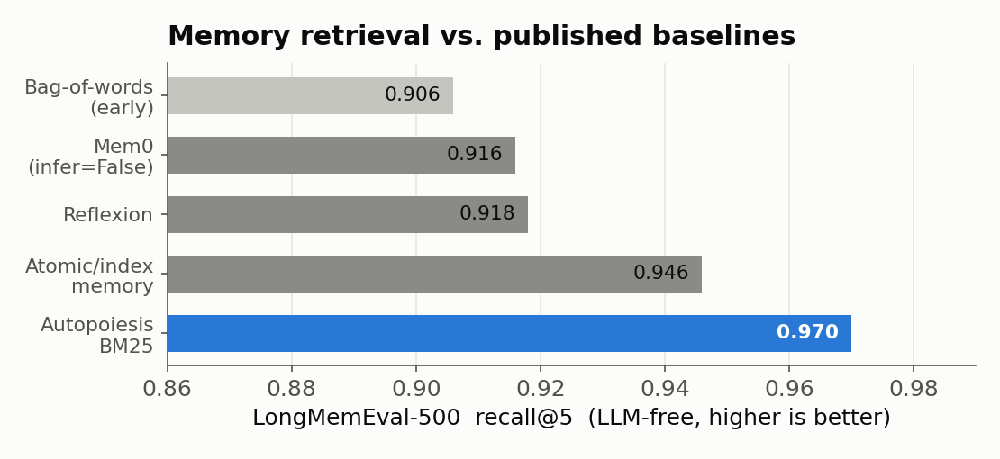
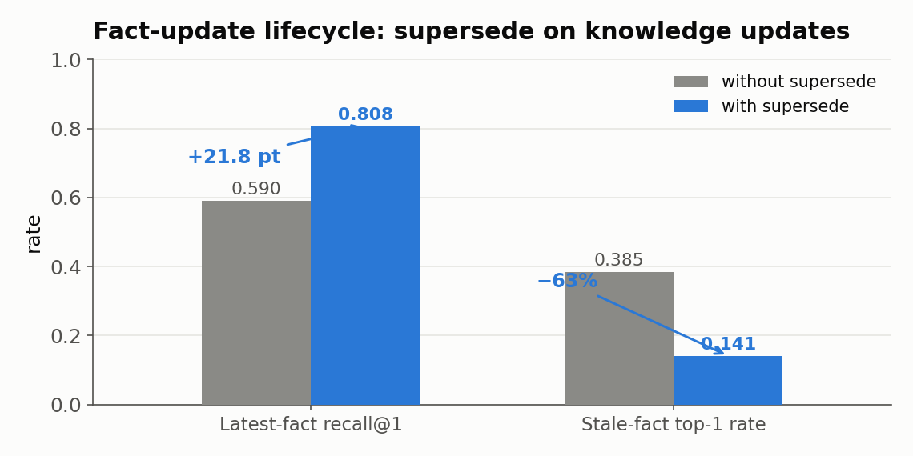

# Autopoiesis-AgentSys

**长周期 Agent 的自演化记忆内核。** 面向连续运行数周的智能体暴露的失效模式——记忆变旧或被污染、上下文无节制膨胀、技能过多干扰模型、有用经验沉淀不成稳定策略——把这些做成一个可测量、可回放、可演化的记忆生命周期。首个落地场景是真实 FortiGate/R230 内网日志的根因分析（RCA）。全部数字出自 [`core/`](./core) + [`domains/`](./domains) 的确定性 Python 内核。

<p align="left">
<b>百万级向量索引</b>&nbsp;·&nbsp;<b>8900 万+ 实时网络事件接入</b>&nbsp;·&nbsp;<b>十万条持续变更索引</b>&nbsp;·&nbsp;<b>404 项确定性测试</b>&nbsp;·&nbsp;<b>真实生产日志留出集</b>
</p>

在同一套 LLM-free、可复现的评测下，记忆检索在 LongMemEval-500 上追平 BM25 词法上限并超过 Mem0、Reflexion 与原子/索引记忆；索引层在百万级向量上给出可调的召回–延迟前沿，在十万级文档持续变更下把查询延迟压掉两个数量级。

设计主线：**在线路径保持小，后台路径负责学。**

```text
在线:  任务 → BM25/资产/关系召回（可选 HNSW 稠密路）→ 上下文编译 → 技能调度 → 执行 → 验证 → trace
后台:  核验通过的 trace → 记忆整合/反思 → PostgreSQL 事务提交 → 索引事件投影 → 后台压缩
```

## 记忆检索：追平词法上限，超越已发表方案

检索核心从词袋匹配升级为分段 BM25 后，LongMemEval-500 的 recall@5 从 0.906 提到 **0.970**，追平该任务的 BM25 词法天花板，并高于 Mem0（infer=False，0.916）、Reflexion（0.918）与 Claude Code 式原子/索引记忆（0.946）。评测逐位复现各方案自报口径，全程 LLM-free。



记忆系统的真正差异化在写入侧的生命周期治理。事实更新场景下，时序互近邻 `supersede` 在旧记忆改写同实体根因时将其退役，最新答案的 recall@1 提升 **21.8 个百分点**，陈旧答案冒到首位的比例下降 **63%**。



## 向量索引：百万级规模上的召回–延迟前沿

FAISS 索引规模压测在确定性合成高斯向量上以 Flat 精确结果为真值，实测十万与百万规模的构建时间、索引体积、P95、吞吐与 Recall@10。百万条 128 维向量上，HNSW 通过 `efSearch` 扫出一条完整的召回–延迟前沿：从 `ef=32` 的 0.443@0.97ms 到 `ef=1024` 的 **0.846@21.4ms**，全程单请求 QPS 高于 Flat 精确检索（Flat P95 36.4ms、QPS 27.9）；冷构建 909.7s、索引 784MB。


## 索引生命周期：持续变更下压掉两个数量级

BM25 从查询时全量重建改为热增量倒排 + 不可变封存段 + 删除标记 + 后台压缩，查询按活跃集合的全局统计统一评分。十万条文档、20% 变更量下，查询 P95 从 929.8ms 降到 **12.0ms（77.75 倍）**，压缩回收 25% 物理条目且 Top-10 完全一致。


向量侧同理：HNSW 承担不可变基础代际，新版本进入精确增量层，删除由版本表立即过滤，后台锁外重建并原子切换。十万条向量经一万次更新与一万次删除后压缩回收两万条旧向量，P95 从 1.34ms 降到 0.98ms，重启结果一致。

| 能力 | 场景 | 结果 |
|---|---|---|
| 混合知识检索 | 9014 条厂商文档切片 recall@10 | BM25 主链路 + 稠密补充，0.33 → **0.42** |
| 检索路由 | 稠密路失败模式归因 | 86% 为时序歧义（对实体、错事件），据此固定按数据类型选路 |
| 上下文编译 | 2048 token 预算、八段结构化上下文 | 空分区预算回收、必需证据全保留、根因准确率不受损 |
| 技能注意力调度 | 六类真实留出事件根因准确率 | 开启 **100%**，关闭 16.7%（承重组件） |
| 效用驱逐 | 容量预算 B=10 | 优于 Ebbinghaus 衰减、LRU 与随机 |

## 应用场景

- **内网根因分析**：真实 FortiGate/R230 日志的告警取证与根因诊断，历史记忆提出根因假设，当前只读取证提供证据，引用核验通过后发布结论。六类真实事件端到端分类准确率 100%。
- **实时态势感知**：Redpanda 跨节点事件流承载边缘采集与中心分析，实时管线累计接入 8900 万+ 网络事件与 93 万+ 告警，事件时间水位线、迟到窗口、去重与原子检查点保证乱序处理与重启恢复。
- **只读攻击面侦察**：白名单内 TCP 连接探测、服务映射、TLS 握手，产出加固建议，全程无凭据、无漏洞利用、无配置写入。
- **环境感知与盲区点名**：在事故被记录之前扫描原始网关语料，指出地址重复、租约反复重建、单主机多地址、会话元组冲突、管理面凭据攻击；报告同时给出现有数据源能证明的结论和需要补哪个传感器才能覆盖的盲区。
- **企业运维与定价工作流**：合成 fixture 上的确定性业务编排与安全发布治理。

## 记忆系统

- **三层记忆**（情景/语义/程序）+ 写入路由（ADD/UPDATE/NOOP）+ 可展开关联链 + 重要度门控反思。事件带观测时间、来源轨迹和类型化关系，`similar_to` 只参与召回。
- **在线混合召回**：分段 BM25、精确资产命中与有界两跳关系展开产生候选，`AUTOPOIESIS_ENABLE_VECTOR_MEMORY=1` 后加入 HNSW 语义候选并用结构先验重排。每条候选的词法分、向量分、资产命中、图跳数和最终分进入执行轨迹。
- **写入侧生命周期**：冲突消解 `supersede`、容量预算下的效用驱逐（保护先验）。
- **事实持久化**：PostgreSQL 当前状态表与只追加事件流在同一事务提交，乐观版本拒绝并发覆盖；消费端按单调偏移把事件投影到 BM25、资产索引与向量索引，全部成功后推进检查点。

## 编排与验证

- **级联意图路由**：规则快路径处理高频确定请求，语义检索召回候选技能，复合与歧义请求升级 Agent，未命中触发技能库自扩展（回放回归门通过后入库）。
- **技能注意力调度**：相关性做硬门，学到的成功率与误用率在相关集内排序。承重组件，关闭后六例真实留出集准确率由 100% 落到 16.7%。
- **验证**：写动作执行前检查前置条件与人工审批凭证，执行后检查后置条件、不变量与真实状态回读，失败立即停止并执行可回读补偿；诊断侧拒绝无引用、虚构引用与矛盾证据。
- **自适应升级**：单 Agent 升级为 planner-executor-critic，按证据歧义与影响面门控。

## 评测与可复现

评测为 LLM-free、确定性、可复现。观测层展示真实记录的检索分解、上下文裁剪、记忆归因与索引状态。真实 R230 FortiGate 留出集（6 类事件 × 4 pass，规则推理器）上取证 32 次，根因准确率与引用核验均为 100%，关闭技能调度后落到 16.7%。

```bash
python3 examples/benchmarks.py        # §1–§3，真实 R230 集
python3 -m pytest tests_py/ -q        # 全量测试，404 passed / 9 skipped
```

## 前端与可观测

[`frontend/`](./frontend) 是 React/Vite 战术态势界面与 FastAPI 网关。`POST /api/rca/diagnose` 使用服务级长生命周期运行时，核验通过后整合记忆并触发索引维护；`/api/healthz` 暴露持久化、事件投影、索引代际、压缩线程与失败状态。后端另存逐节点追加式轨迹，覆盖召回、演变分析、技能与工具、上下文、推理、核验、记忆提交、事件持久化与后台索引维护，`run_id` 定位单次运行、`session_id` 聚合同一事故的多次运行，查询接口返回失败、部分完成、未完成节点、瓶颈与跨运行退化信号。实现见 [`docs/EXECUTION_OBSERVABILITY.md`](./docs/EXECUTION_OBSERVABILITY.md)。

`frontend/script/vreview.mjs` 用 Playwright 驱动真实浏览器做可测量前端验证（实际裁切、axe 对比度、横向滚动、console 错误、像素 diff）。

## 环境感知与传感器覆盖

[`domains/network_rca/environment.py`](./domains/network_rca/environment.py) 扫描原始网关语料，在事故被记录之前指出环境异常：地址重复、作用域内无租约绑定、租约反复重建、单主机多地址、会话元组冲突、地址池压力、管理面凭据攻击。接口 `GET /api/rca/environment`，界面在 `渗透` 页。判定同时使用实时源与全历史：每个源标注是否仍在写入，每条判定出报告前对仍在写入的源复核一次。

报告分两半：`findings[]` 是现有数据源能证明的，`coverage[]` 按故障类点名现有数据源无法证明的部分并写明补哪个传感器能覆盖。这一半来自一次真实事故：192.168.1.23 被一台静态配置设备与服务器同时占用数周，唯一身份来源是网关 DHCP 服务器而占用方从未发过 DHCP 包，L2 身份源（ARP / neighbour 表）补上这一类，判定跨采集序列做归属漂移。设计与接入见 [docs/ENVIRONMENT_PERCEPTION.md](./docs/ENVIRONMENT_PERCEPTION.md)。

## 数据

- 真实：网络设备日志、厂商技术文档、IODA v2 断网事件池、LongMemEval-500。
- 真实告警与日志含内外网 IP，走 gitignore 本地留存；仓库内带脱敏 seed 与合成 fixture，克隆后基准回退到 seed 并标注所用数据集。

## 目录

```text
core/memory/        三层记忆、BM25 检索核心、hybrid_kb 混合检索器、拓扑图记忆
core/evolve/        写入路由、A-MEM、反思、冲突消解 supersede、效用驱逐、自演化流、observatory
core/context/       结构化预算上下文压缩
core/orchestrator/  级联意图路由、自适应编排、技能调度
core/skills/        技能注册表、技能诱导、契约
core/verifier/      契约验证、引用核验
core/eval/          确定性基准、混合检索评测、独立模型证据评审与配对消融
core/llm/           OpenAI 兼容 provider（外部 API 与本地 GPU 后端）
domains/network_rca  首个落地域：内网 RCA
domains/active_recon 只读侦察 / 加固报告
domains/enterprise_ops 企业运维 / 定价工作流（合成 fixture）
frontend/           React/Vite 战术态势界面 + 记忆 observatory + FastAPI 网关
```

## 推理后端

在线路径使用 OpenAI 兼容 provider，支持外部 API 与本地 GPU 部署两种后端；确定性基准走内置规则推理器；语义支持评测使用隔离的模型评审接口。核心评测与命令行路径读取 `AUTOPOIESIS_LLM_*` 配置。

## roadmap

- 候选改进须通过验证器与回放门才生效，Agent 不能自由改写生产行为。
- GRPO 组相对策略优化在 [`core/evolve/`](./core/evolve) 有确定性规则版实现，在线路径使用规则推理器与 OpenAI 兼容 provider，GPU 侧梯度训练在 roadmap 中。

## 研究参考

CoALA（arXiv:2309.02427）· Mem0（2504.19413）· A-MEM（2502.12110）· Generative Agents（2304.03442）· StreamBench（2406.08747）· LongMemEval（2410.10813）· FreshDiskANN · SPFresh · Quake。记忆研究引用见 [docs/BENCHMARKS.md](./docs/BENCHMARKS.md)，动态索引研究见 [docs/INDEX_LIFECYCLE_RESEARCH.md](./docs/INDEX_LIFECYCLE_RESEARCH.md)。
